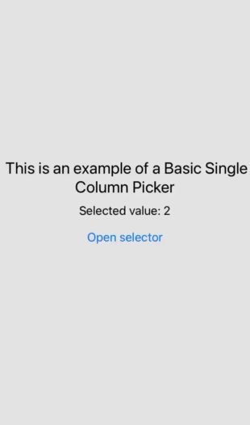

# react-native-multicolumn-modal-picker

&nbsp;&nbsp;&nbsp;&nbsp;&nbsp;&nbsp;&nbsp;&nbsp;&nbsp;&nbsp;&nbsp;&nbsp;&nbsp;

## Package dependencies

&nbsp;&nbsp;&nbsp;&nbsp;

For users of `npm v7 or higher`, `react-native-multicolumn-modal-picker` will automatically install the `@react-native-picker/picker` dependency. This is due to npm v7+'s support for automatic peer dependency installation, simplifying dependency management.

In version 1.0.5 of the package, `prop-types` dependency has been included for runtime prop type validation. This addition enhances error detection and code quality. It also eases component implementation by providing autocomplete with a brief description of each prop and its data type. This addition has a more technical focus and is intended to improve the developer's experience, it does not affect the overall operation of the package and its implementation is transparent to end users.

## Prerequisites

This package is compatible with existing React Native projects, whether you’re using `Expo` or pure `React Native`. It has been tested and verified with `react-native` version `0.72.5` and `expo` version `49.0.8`. If you experience any issues when using it with other versions, please feel free to [report it](https://github.com/Rio9735/react-native-multicolumn-modal-picker/issues/new).

## Description

`react-native-multicolumn-modal-picker` It is a highly customizable React Native component for the `iOS` platform. It allows you to configure up to 3 selection columns in the same picker. By default, it can be used as a simple selector.

## Installation

### Using npm

```bash
npm install react-native-multicolumn-modal-picker
```

This command installs the `react-native-multicolumn-modal-picker` package in your current project using `npm`.

### Using yarn

```bash
yarn add react-native-multicolumn-modal-picker
```

This command installs the `react-native-multicolumn-modal-picker` package in your current project using `yarn`.

### If you are using Expo

```bash
npx expo install react-native-multicolumn-modal-picker
```

This command is specific for `Expo` projects. It installs the package `react-native-multicolumn-modal-picker` and also automatically handles compatibility with the `Expo` version. It’s important to use this command instead of `npm install` or `yarn add` when you’re working on an `Expo` project.

## Compatibility

Currently, this package is optimized for `iOS`. Although it is compatible with `Android`, I decided to restrict its use only to `iOS` as it does not provide a good user experience on `Android`. I’m considering improving this experience and making it fully functional on `Android` too. Your opinion matters to me. Please spare a minute to share your thoughts [here](https://docs.google.com/forms/d/e/1FAIpQLSd3CWTSYT7DJcdCAMP_pE5IG8DrHc0QE2q42jden6JhgyP2PA/viewform?usp=sf_link). Thank you for your patience!

## Usage

```bash
import MultiColumnModalPicker from 'react-native-multicolumn-modal-picker';
```

You can use the `MultiColumnModalPicker` component in your application as follows:

## Examples

<p align="center">
  
  
  
</p>

### 1. Basic Single Column Picker

```JS
import React, { useState } from "react";
import { View, Button, Text, StyleSheet } from "react-native";
import MultiColumnModalPicker from "react-native-multicolumn-modal-picker";

const App = () => {
  const [visible, setVisible] = useState(false);
  const [selectedValue, setSelectedValue] = useState(2);

  const options = [
    { label: "Option 1", value: 1 },
    { label: "Option 2", value: 2 },
    { label: "Option 3", value: 3 },
  ];

  return (
    <View style={styles.container}>
      <Text style={styles.title}>
        This is an example of a Basic Single Column Picker
      </Text>
      <Text style={styles.selectedValue}>Selected value: {selectedValue}</Text>
      <Button
        title="Open selector"
        onPress={() => {
          setVisible(true);
        }}
      />
      <MultiColumnModalPicker
        visible={visible}
        column1={options}
        selectedValue1={selectedValue}
        onValueChange1={(value) => setSelectedValue(value)}
        onClose={() => setVisible(!visible)}
      />
    </View>
  );
};

const styles = StyleSheet.create({
  container: {
    flex: 1,
    justifyContent: "center",
    alignItems: "center",
    backgroundColor: "#E6E6E6",
  },
  title: {
    fontSize: 24,
    textAlign: "center",
  },
  selectedValue: {
    fontSize: 18,
    marginVertical: 10,
  },
});

export default App;
```

### 2. Two columns picker

```JS
import React, { useState } from "react";
import { View, Button, Text, StyleSheet } from "react-native";
import MultiColumnModalPicker from "react-native-multicolumn-modal-picker";

// Component that implements a modal selector with two columns.
const App = () => {
  // State variables for the visibility of the selector and the selected hour and minute
  const [visible, setVisible] = useState(false);
  const [selectedHour, setSelectedHour] = useState(null);
  const [selectedMinute, setSelectedMinute] = useState(null);
  const [formattedTime, setFormattedTime] = useState("");

  // Arrays for the hours and minutes options in the selector
  const hours = Array.from({ length: 24 }, (_, i) => ({
    label: `${i}`.padStart(2, "0"),
    value: `${i}`.padStart(2, "0"),
  }));
  const minutes = Array.from({ length: 60 }, (_, i) => ({
    label: `${i}`.padStart(2, "0"),
    value: `${i}`.padStart(2, "0"),
  }));

  // formatTime function converts the selected hour and minute into a time string.
  const formatTime = (hour, minute) => {
    let date = new Date();
    date.setHours(hour);
    date.setMinutes(minute);

    return date.toLocaleTimeString([], { hour: "2-digit", minute: "2-digit" });
  };

  // In this case, action that is executed when pressing outside of the modal, since the accept button is not displayed in the example.
  const onAccept = () => {
    setFormattedTime(formatTime(selectedHour, selectedMinute));
  };

  return (
    <View style={styles.container}>
      <Text style={styles.title}>
        This is an example of a Two-Column Picker
      </Text>
      {formattedTime && (
        <Text style={styles.timeText}>
          The selected time is: {formattedTime}
        </Text>
      )}
      <Button title="Select Time" onPress={() => setVisible(true)} />
      <MultiColumnModalPicker
        visible={visible}
        showCancelButton
        column1={hours}
        column2={minutes}
        onValueChange1={(value) => setSelectedHour(value)}
        onValueChange2={(value) => setSelectedMinute(value)}
        selectedValue1={selectedHour}
        selectedValue2={selectedMinute}
        onClose={()=> setVisible(false)}
        onAccept={onAccept}
        // Custom styles
        hPadding={80}
        bgColor="#097CF6"
        selectionHighlightColor="#0024FF"
        cancelButtonBgColor="#2E7DD1"
        cancelButtonTextStyle={{ color: "#F0F0F0" }}
      />
    </View>
  );
};

const styles = StyleSheet.create({
  container: {
    flex: 1,
    justifyContent: "center",
    alignItems: "center",
    backgroundColor: "#F0F0F0",
  },
  title: {
    fontSize: 22,
    textAlign: "center",
    marginBottom: 20,
  },
  timeText: {
    marginBottom: 20,
    fontSize: 18,
    color: "#333333",
  },
});

export default App;
```

### 3. Single column picker with search bar

```JS
import React, { useCallback, useState } from "react";
import { View, Button, Text, StyleSheet } from "react-native";
import MultiColumnModalPicker from "react-native-multicolumn-modal-picker";

const App = () => {
  const [visible, setVisible] = useState(false);
  const [selectedValue, setSelectedValue] = useState("+33");
  const [selectedCountry, setSelectedCountry] = useState("France");

  let options = [
    { label: "Australia", value: "+61" },
    { label: "Argentina", value: "+54" },
    { label: "Brazil", value: "+55" },
    { label: "Croatia", value: "+385" },
    { label: "England", value: "+44" },
    { label: "France", value: "+33" },
    { label: "Japan", value: "+81" },
    { label: "Morocco", value: "+212" },
    { label: "Netherlands", value: "+31" },
    { label: "Poland", value: "+48" },
    { label: "Portugal", value: "+351" },
    { label: "Senegal", value: "+221" },
    { label: "South Korea", value: "+82" },
    { label: "Spain", value: "+34" },
    { label: "Switzerland", value: "+41" },
    { label: "United States", value: "+1" },
  ];

  // Create a mapping object from the values (phone codes) to the labels (country names), especially useful when the array is very large.
  const countryByPhoneCode = options.reduce((map, option) => {
    map[option.value] = option.label;
    return map;
  }, {});

  // Get the label (country name) from the selected value (phone code).
  const getCountry = useCallback(() => {
    return countryByPhoneCode[selectedValue];
  }, [selectedValue]);

  return (
    <View style={styles.container}>
      <Text style={styles.title}>
        This is an example of a Single Column Picker with Search Bar
      </Text>
      <Text style={styles.selectedValue}>
        {selectedCountry} phone code: {selectedValue}
      </Text>
      <Button
        title="Open selector"
        onPress={() => {
          setVisible(true);
        }}
      />
      <MultiColumnModalPicker
        visible={visible}
        searchBar
        column1={options}
        showActionButtons
        rightInfo={selectedValue}
        onValueChange1={(value) => setSelectedValue(value)}
        selectedValue1={selectedValue}
        onClose={() => setVisible(false)}
        onAccept={() => setSelectedCountry(getCountry())}
      />
    </View>
  );
};

const styles = StyleSheet.create({
  container: {
    flex: 1,
    justifyContent: "center",
    alignItems: "center",
    backgroundColor: "#111827",
  },
  title: {
    fontSize: 22,
    textAlign: "center",
    marginBottom: 20,
    color: "#E6E6E6",
  },
  selectedValue: {
    fontSize: 18,
    marginVertical: 10,
    color: "#E6E6E6",
  },
});

export default App;
```

## Props

The `MultiColumnModalPicker` component accepts the following props:

### Required Properties: These are essential for the component to function. The values shown here are based on [Example 1](#1-basic-single-column-picker)

| **Required Properties** | **Type**      | **Description**                                                                                                                                                                                                                                                                                                                                                | **Usage**                                               |
|-------------------------|---------------|----------------------------------------------------------------------------------------------------------------------------------------------------------------------------------------------------------------------------------------------------------------------------------------------------------------------------------------------------------------|---------------------------------------------------------|
| `visible`                 | Boolean       | Determines whether the modal is visible or not.                                                                                                                                                                                                                                                                                                                | visible={visible}                                       |
| `column1`                 | Array         | An array of objects with options for the first column. Each object must have a "label" property and a "value" property.                                                                                                                                                                                                                                        | column1={options}                                       |
| `selectedValue1`          | String/Number | The selected value in the first column.                                                                                                                                                                                                                                                                                                                        | selectedValue1 = {selectedValue}                        |
| `onValueChange1`          | Function      | A function that is called when selected value in first column changes.                                                                                                                                                                                                                                                                                         | onValueChange1={(newValue) => setSelectedValue(newValue)} |
| `onClose`                 | Function      | This property is crucial for closing the selector. It’s best to use `onClose` just for closing the modal without adding any extra actions, as it’s used both when **accepting** and **cancelling**.                                                                                                                                                                                                                                                                                                                            | onClose={() => setVisible(!visible)}                    |

### General Properties

* `onClose`:  _**(Required)**_, _(Function)_ This property is crucial for closing the selector. It’s best to use `onClose` just for closing the modal without adding any extra actions, as it’s used both when **accepting** and **cancelling**.
* `visible`: _**(Required)**_, _(Boolean)_ Determines whether the modal is visible or not.
* `actionButtons` _(Optional)_, _(String)_ Controls the visibility and position of the “Accept” and “Cancel” action buttons. The possible values are:
  * `"none"`: No action buttons are displayed. This is the default value.
  * `"cancel"`: Only the “Cancel” button is displayed at the bottom.
  * `"top"`: Both “Accept” and “Cancel” buttons are displayed at the top.
  * `"bottom"`: Both “Accept” and “Cancel” buttons are displayed at the bottom.
* `acceptButtonText`: _(Optional)_, _(String)_ Accept button label. Default is _"Accept"_
* `cancelButtonText`: _(Optional)_, _(String)_ Cancel button label. Default is _"Cancel"_
* `onAccept`: _(Optional)_, _(Function)_ This function is triggered when the user confirms a selection by pressing the accept button or touching outside of the picker. The inherent logical actions are managed automatically. If this function is defined, it will be added to the existing behavior, not overwrite it.
* `onCancel`: _(Optional)_, _(Function)_ A function that is called when the user cancels the selection by pressing the cancel button or the physical back button. The inherent logical actions are managed automatically. If this function is defined, it will be added to the existing behavior, not overwrite it.
* `rightInfo`: _(Optional)_, _(String)_ Text displayed on the right side of the selector. It’s suggested to avoid using with hPadding for best results. This is a guideline, not a rule.
* `title`: _(Optional)_, _(String)_ Title of picker.

### Column 1 Related Properties

* `column1`: _**(Required)**_, _(Array)_ An array of objects with options for first column. Each object must have a ‘label’ property and a ‘value’ property.
* `onValueChange1`: _**(Required)**_, _(Function)_ A function that is called when selected value in first column changes.
* `selectedValue1`: _**(Required)**_, _(String/Number)_ The selected value in first column. Initialization required upon usage.

### Column 2 Related Properties. To define `column2` , `column1` is required

* `column2`: _(Optional)_, _(Array)_ An array of objects with options for second column. Each object must have a ‘label’ property and a ‘value’ property.
* `onValueChange2`: _**(Required if `column2` is defined)**_, _(Function)_ A function that is called when selected value in second column changes.
* `selectedValue2`: _**(Required if `column2` is defined)**_, _(String/Number)_ The selected value in second column. Initialization required upon usage.

### Column 3 Related Properties. To define `column3` , both `column1` and `column2` are required

* `column3`: _(Optional)_, _(Array)_ An array of objects with options for third column. Each object must have a ‘label’ property and a ‘value’ property.
* `onValueChange3`: _**(Required if `column3` is defined)**_, _(Function)_ A function that is called when selected value in third column changes.
* `selectedValue3`: _**(Required if `column3` is defined)**_, _(String/Number)_ The selected value in third column. Initialization required upon usage.

### Search Bar Related Properties. The use of the Search Bar is completely optional. It can only be used in conjunction with a single column picker. The Search Bar should be combined with `column1`

* `searchBar`: _(Optional)_,_(Boolean)_ Indicates whether the search bar is displayed or not. _**(Please note that the search bar can only be used when the selector has a single column, specifically with `column1`.)**_
* `searchBoxStyle`: _(Optional)_,_(JSX style object)_ Determines the style of the search bar. Accepts standard React Native style properties.
* `searchPlaceholder`: _(Optional)_,_(String)_ Placeholder of the search bar. The default value is "Search here".
* `searchElementsColor`: _(Optional)_, _(String)_ Defines the color of both the search bar placeholder and the clear button within the search bar. Accepts standard React Native color values.
* `searchTextStyle`: _(Optional)_,_(JSX style object)_ Determines the text style of the search bar. Accepts standard React Native style properties.

### Style Related Properties

* `acceptButtonTextStyle`: _(Optional)_, _(JSX style object)_ Style of the accept button text. Accepts standard React Native style properties.
* `actionButtonsBorderColor`: _(Optional)_, _(String)_ This property sets the border color of the action buttons. It is only applicable when `actionButtons` is set to `“top”` or `“bottom”`. Accepts standard React Native color values.
* `bgColor`: _(Optional)_, _(String)_ Background color of modal. Accepts standard React Native color values.
* `cancelButtonBgColor`: _(Optional)_, _(String)_ This property sets the background color of the “cancel button” that appears at the bottom of the picker. Accepts standard React Native color values.
* `cancelButtonTextStyle`: _(Optional)_, _(JSX style object)_ Style of the cancel button text. Accepts standard React Native style properties.
* `hPadding`: _(Optional)_, _(Number > 0)_ Adds extra horizontal space around the picker.
* `itemStyle`: _(Optional)_, _(JSX style object)_ Style of the picker items. Accepts standard React Native style properties.
* `rightInfoTextStyle`: _(Optional)_, _(JSX style object)_ Style of text for additional information to right side of modal. Accepts standard React Native style properties.
* `selectionHighlightColor`: _(Optional)_, _(String)_ Color of the selection highlight. Accepts standard React Native color values.
* `titleStyle`:  _(Optional)_, _(JSX style object)_ Style of the title text. Accepts standard React Native style properties.

## Contributing

Contributions are welcome to `react-native-multicolumn-modal-picker`.

If you have an idea for a new feature or have discovered a bug, please open an [issue](https://github.com/Rio9735/react-native-multicolumn-modal-picker/issues/new) or participate in a [discussion](https://github.com/Rio9735/react-native-multicolumn-modal-picker/discussions/1).

Don't forget to add a **title** and a **description** explaining the issue you're trying to solve and your proposed solution.

Screenshots or gifs are helpful to add to the repository for reviews.

## Do you like this package?

Thank you for using my package! Your support is greatly appreciated and it motivates me to continue improving and adding new features. If you find my package useful, please consider giving it a :star: on GitHub. This lets me know that I’m on the right track and encourages me to keep going.

[Give it a star!](https://github.com/Rio9735/react-native-multicolumn-modal-picker)

## Changelog

For a detailed list of changes in each version, please refer to the [CHANGELOG](./CHANGELOG.md)

## Author

_**Río**_

Feel free to [Contact me](mailto:markidelrio@gmail.com).

## License

The library is released under the MIT license. For more details see [LICENSE](./LICENSE)
